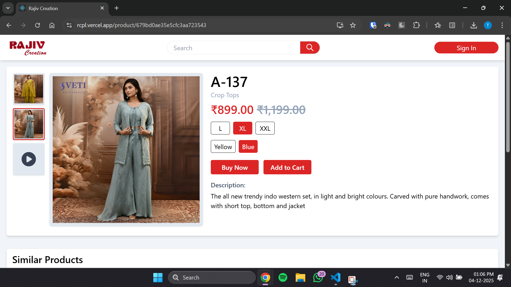

[](https://rcpl.vercel.app/)
# Rajiv Creation Pvt. Ltd. (rcpl)

A modern fashion eCommerce platform built using React, MongoDB, Express, Stripe, FastBot, Google OAuth, and Docker.

## Screenshot
Here is a screenshot from the live demo:



## Features
### User Features
- **User Authentication**: Login via Google OAuth or email/password.
- **Product Browsing**: Users can view products, zoom in, and search by category.
- **Search & Filtering**: Enhanced product discoverability with category-based search and sorting options.
- **Shopping Cart & Checkout**:
  - Users must log in before adding products to the cart.
  - Address required before placing an order.
  - Stock management ensures only available sizes and colors are displayed.
  - Payment via Stripe or Cash on Delivery.
- **AI Chatbot**: An integrated AI chatbot offers product recommendations and resolves customer inquiries.
- **Order Tracking**: Users can view their order status (Pending, Confirmed, Delivered) from their profile.
- **Password Management**: Users can change their password using Nodemailer.
- **Pagination**: Search results are paginated for better performance.

### Admin Features
- **User Management**: View users, assign roles, and manage access.
- **Product Management**: Add, update, and manage product inventory, including stock for different sizes and colors.
- **Order Management**: View all orders and update their statuses.
- **Stock Management**: Tracks inventory for each product’s size and color, ensuring accurate availability display.

## Tech Stack
- **Frontend**: React.js
- **Backend**: Express.js, Node.js
- **Database**: MongoDB
- **Authentication**: Google OAuth
- **Payments**: Stripe
- **AI Chatbot**: FastBot
- **Email Services**: Nodemailer
- **Containerization**: Docker

### Installation
1. Clone the repository:
   ```bash
   git clone https://github.com/changrtanay/rcpl.git
   cd rcpl
   ```
2. Install dependencies:
   ```bash
   npm install
   ```
3. Start the development server:
   ```bash
   npm run dev
   ```
4. To run using Docker:
   ```sh
   docker-compose up --build
   ```
5. Open your browser and navigate to `http://localhost:3000`

## Contributing
Feel free to open issues or submit pull requests to enhance the platform.

## License
This project is licensed under the MIT License.

